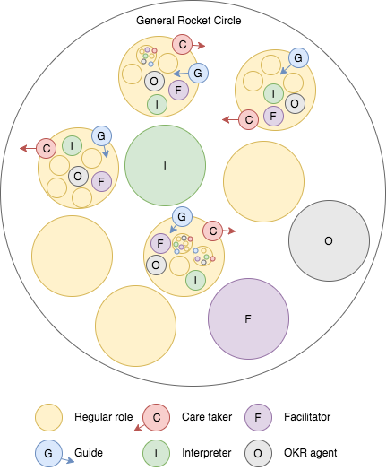

# Nothing Interactive Constitution

## PREAMBEL

This constitution defines the rules and processes of Nothing Interactive's authority structure. All crew members including the CEO (= ratifier) agree to adopt the constitution and play by its rules.

## ARTICLE I: Purpose

Nothing Interactive's purpose is to **create products which matter**. To execute our purpose, we orient to the following core values:

- **Simple** : In all that we do, we focus on the essential in order to develop ideas which make everyday life simpler.
- **Human** : We strive for a deep understanding of people so that we can enable them through technology to go beyond their current capabilities.
- **Open** : We embrace an open-minded culture where transparency, collaborative spirit and learning from failures create a fertile ground for passion and excellence.

You are free to take any action to fulfil Nothing Interactive's purpose, so long as your action does not break the rules of the constitution.

## ARTICLE II: Roles

### 2.1 DEFINITION OF A ROLE

Crew members will typically perform work by acting in an explicitly defined role. Each role has a descriptive name as well as the following:

1. (a) A purpose: This is the ultimate that the role strives to express within the larger purpose of Nothing Interactive (see Article I). As such, the purpose guides the actions of the role.

2. (b) Domains: These are areas and/or resources that the role may exclusively control and regulate.

3. (c) Accountabilities: These are ongoing activities which the role performs.

### 2.2 RESPONSIBILITIES AND AUTHORITY OF ROLES

Once you fill a role, you have the authority to take any action necessary to fulfil the role's purpose or perform its accountabilities, so long as

- your action does not impact another role's domain(s), unless that role has given you permission to impact its domain and

- your action does not violate the constitution.

If you fill a role, you agree to do the following:

- Expressing the purpose: You strive to express the role's purpose in the best possible way. You take any action that you see fit to do this.

- Processing tensions: You monitor how well your role can fulfil its purpose. If you notice a gap between what your role currently does and what it could potentially do (a so-called "tension"), you note down the tension and take action to resolve it by making a proposal using the governance process (see section 4.2).

- Performing accountabilities: You perform any accountabilities assigned to the role.

### 2.3 AUTHORITY OVER DOMAINS

Once you fill a role, you have the authority to control and regulate all domains of that role: You can decide to what extent other roles can impact your domains. You can give access on a case-by-case basis or define **policies**.

A policy either extends or limits how a role can impact a domain. Specifically, a policy documents how a role may impact and control parts of another role's domain, and how this limits that other role in its control over the domain. A role can only define policies for its own domain(s).

Before a policy becomes valid, it must be shared openly with all roles impacted by it and, if need be, processed in a governance meeting (see section 4.3).  The role that first specified a policy may revoke that policy at any time. To do so, they follow the same process as for introducing a policy.

## 2.4 INDIVIDUAL ACTION

You are only allowed to act within your roles. You can make an exception by taking **individual action**, if

1. (a) you are acting in the best interest of Nothing Interactive and

2. (b) there is no time to request permission normally required from other roles and

3. (c) you reasonably believe your action would resolve or prevent more tension for Nothing Interactive than it would likely create and

4. (d) your action would not cause spending of the Nothing Interactive's resources beyond what you're already authorized to spend.

If you take individual action, you have to inform the roles affected by your action as soon as possible. You have to explain why you took individual action, and, if necessary, take additional actions to resolve any tensions that were created by your individual action.

After taking individual action, informing those affected always becomes your top-most priority. You may reduce that priority if the guide of the circle that contains all impacted roles suggests you do so.

If you keep taking the same individual action, you're likely dealing with a tension that must be addressed with the governance process. You are responsible for taking the necessary steps to make that happen.

## ARTICLE III: CIRCLE STRUCTURE

### 3.1 CIRCLE BASICS

A **circle** is a special type of role: a higher-level role which contains several other roles. (These roles, in turn, may also be circles themselves). The roles within the circle are defined by the circle itself. The roles a circle defines are its **defined roles**, and anyone filling one of its defined roles is a **circle member** of that circle.

#### 3.1.1 DEFINING ROLES & POLICIES

Each circle will use the **governance process** described in Article IV to define or change roles within the circle or policies governing the circle's domain. No one may define or change a circle's roles or policies outside of its governance process, unless explicitly allowed by another rule of this constitution. Each circle may define policies which limit its roles.

#### 3.1.2 ROLES MAY IMPACT CIRCLE DOMAINS

As a circle member, you may use and impact any domain that is controlled by the circle itself, or that the circle is authorized to impact.However, you are also limited by any policies which limit the circle.

#### 3.1.3 CHANGING CIRCLE DOMAINS

Unlike policies for domains of single roles (see section 2.3), policies for changing circle domains may only be defined using the governance process. A circle may use a policy to delegate a domain to a single circle member. The circle may revoke or change such policies at any time using the governance process.

### 3.2 CIRCLE GUIDE

Each circle has a **guide role** (see [Appendix A](/constitution#appendix-a-definition-of-core-roles)) which holds the following additional responsibilities and authorities:

#### 3.2.1 INHERITS CIRCLE ROLE

The guide of a circle holds the overall purpose, accountabilities, and domains of the circle, just as if the circle were only a single role and the guide filled that role. The guide may lose accountabilities and domains of the circle when they are delegated to another role in the circle.

The guide may not define policies that limit the circle's roles, except via the governance process of the circle.

#### 3.2.2 DEFINES PRIORITIES & STRATEGIES

A circle's guide may define **relative priorities** for the circle. In addition, the guide may define a more general strategy or multiple strategies for the circle. Such a strategy is a **heuristic** (=rule-of-thumb) which helps the circle's roles determine priorities on their own.

#### 3.2.3 CHANGING THE GUIDE ROLE

A circle may not add accountabilities or other functions to its own guide role, or modify the role's purpose, or remove the role entirely. Such changes can only happen in the circle's super-circle.

However, a circle may remove any accountabilities, domains, authorities, or functions of its guide role, either by placing them on another role within the circle, or by defining an alternate means of enacting them.

### 3.3 ROLE ASSIGNMENT

The guide of a circle may assign people to fill defined roles in the circle, unless that authority has been limited or delegated. The guide uses people's individual mission statements to decide which person should fill a role.

#### 3.3.1 UNFILLED ROLES

Whenever a defined role in a circle is unfilled, the circle's guide is considered to be filling the role.

#### 3.3.2 ASSIGNING ROLES TO MULTIPLE PEOPLE

A guide may assign multiple people to the same defined role, as long as that will not decrease the clarity of who should enact the accountabilities and authorities of the role in common situations.

As one way of maintaining that clarity, a guide may specify a **focus** along with each assignment, which is an area or context for that person to focus on while executing in the role.

When a role assignment includes a focus, the purpose, accountabilities, and domains defined for the role apply just within the specified focus for that particular person.

#### 3.3.3 RESIGNATION FROM ROLES

When you fill a role, you may resign from the role at any time, unless you've agreed otherwise, by giving notice to whoever controls assignments to that role - typically, the circle's guide.

### 3.4 ELECTED ROLES

Each circle includes **five elected roles** : A **guide**, a **facilitator** , a **interpreter**, a **care taker**, and an **OKR agent** (see [Appendix A](/constitution#appendix-a-definition-of-core-roles)).

#### 3.4.1 ELECTIONS & ELIGIBILITY

The facilitator of each circle will facilitate **regular elections** to elect a circle member of the circle into each of its elected roles, using the process and rules defined in Article IV. All circle members are eligible for election and each may hold multiple elected roles, except for the guide of a circle, who may not be elected as its facilitator, care taker or OKR agent.

#### 3.4.2 ELECTION TERMS & REVISITING

During the election process, the facilitator will specify a term for each election. For guides, the election term should be 6 months. After a term expires, the interpreter is responsible for promptly triggering a new election for that elected role. However, even before a term has expired, any circle member may trigger a new election using the process defined in Article IV.

#### 3.4.3 CHANGING ELECTED ROLES

A circle may extend the accountabilities of its elected roles, as long as the changes do not interfere with the roles' essential purpose, accountabilities, and domains. It may not reduce the elected roles' purpose, accountabilities, and domains defined in this constitution, and it may not remove a role entirely.

#### 3.4.4 SUBSTITUTE FOR ELECTED ROLES

A substitute may temporarily fill an elected role when one is unfilled, or when the person who normally fills the role is unavailable. In that case, the substitute is chosen in the following order:

1. (a) someone explicitly specified by the person to be replaced; or
2. (b) the acting facilitator of the circle; or
3. (c) the acting interpreter of the circle; or
4. (d) the guide of the circle; or
5. (e) the first circle member of the circle to declare he or she is acting as the substitute.

### 3.6 SUB-CIRCLES

A circle may expand any of its defined roles into full circles. The role then becomes a **sub-circle** , with the original circle as its **super-circle**. The guide of the super-circle may specify who fills the guide role of the sub-circle, following the rules in section 3.3. Furthermore, each sub-circle elects a care taker (see [Appendix A](/constitution#appendix-a-definition-of-core-roles)), which cannot be the same person as the guide.

### 3.6.1 MODIFYING SUB-CIRCLES

A super-circle may modify the purpose, domain, or accountabilities of a sub-circle, or remove the sub-circle altogether. A super-circle may also move its own defined roles or policies into a sub-circle, or move any from within the sub-circle into itself. Any of these modifications may only be done via the governance process of the super-circle. Beyond these allowed changes, a super-circle may not modify any defined roles or policies held within a sub-circle.

### 3.7 GENERAL ROCKET CIRCLE

The top-most circle of Nothing Interactive is the so-called **"general rocket circle" (GRC).** The general rocket circle encompasses all other circles and roles. It holds the purpose of Nothing Interactive (Article I). The GRC may update and adapt this purpose using the governance process (Article IV). Note however that it must follow the special rules for changing the constitution (section 6.2) to do so, because Nothing Interactive's purpose is part of the constitution. The GRC controls all domains of Nothing Interactive which have not been allocated to another role. It defines its own accountabilities through the governance process.

The GRC has **no guide**. All decisions which would normally be taken by the guide (see [Appendix A](/constitution#appendix-a-definition-of-core-roles)) go through the circle's governance process. All roles which are directly within the GRC are circle members of the GRC and take part in the governance process. The GRC may use a policy to exclude minor roles from the governance process.

The GRC allocates domains to its sub-circles and its single roles. Unlike in regular circles, circle members of the GRC are only allowed to impact a domain of the GRC if it has been allocated to them, otherwise, decisions concerning GRC domains must go through the GRC's governance process.

## ARTICLE IV: GOVERNANCE PROCESS

### 4.1 SCOPE OF GOVERNANCE

The governance process of a circle has the power to:

1. (a) Define, change, or remove the circle's roles and sub-circles; and
2. (b) Define, change, or remove the circle's policies; and
3. (c) Hold elections for the circle's elected roles.

At any given time, the then-current results of a circle's governance process define its acting **governance**, that is to say, the rules which determine how authority is distributed in the circle.

The results of a circle's governance process are captured in its governance records. Unless specified otherwise, the governance process takes place in the form of a governance meeting (see section 4.3).

### 4.2 CHANGING GOVERNANCE

Any member of a circle may propose changing its governance by making a **proposal**.

Before a proposal is adopted, all circle members must have the opportunity to raise **tensions** (= the perception of a gap between current reality and a sensed potential) about adopting the proposal. Each tension so raised is considered an **objection** if it meets the criteria defined under 4.2.3 below.

Proposals are considered adopted and change the governance of the circle only if no objections are so raised. If objections are raised, the objection is processed in the governance meeting following the governance process (see 4.3.4 (e)).

#### 4.2.1 MAKING PROPOSALS

Any circle member may make a proposal within a **governance meeting** of the circle called under the terms of section 4.3. Alternatively, a circle member may distribute a proposal to all other circle members separately, outside of a governance meeting, using any written communication channel approved for this purpose by the circle's interpreter. However, the circle's facilitator should be presented with the proposal first to determine whether it fulfils the criteria for valid proposals (section 4.2.2.).

For this separate processing of proposals, the facilitator may either apply the same process and rules used within a governance meeting, or may allow each circle member to directly declare whether or not he or she has objections to integrate. Further, at any point before a separately distributed proposal is adopted, any circle member may stop the separate processing by requesting the proposer escalate the proposal to a governance meeting, and notifying the circle's interpreter.

A circle may adopt policies to further constrain when or how proposals may be made or processed outside of a governance meeting. However, circle members are always allowed to escalate separate processing of a proposal to a governance meeting, and no policy may change that.

#### 4.2.2 CRITERIA FOR VALID PROPOSALS

Some proposals are disallowed within a circle's governance process, and the facilitator may discard these before they are fully processed.

To be valid for processing, a proposal must

1. (a) solve or reduce a tension affecting the role which makes the proposal and
2. (b) help this role better express its purpose or express one of its accountabilities.

Proposals may only be made on behalf of other roles if specific permission has been given to represent that role.

Finally, a proposal is always valid regardless of the preceding criteria if it is made solely to help evolve the circle's governance to more clearly reflect something that is already happening, or to trigger a new election for any elected role.

#### 4.2.3 TESTING PROPOSALS

The facilitator may test the validity of a proposal by asking the proposer questions. The proposer must be able to describe the tension, and give an example of an actual past or present situation in which the proposal would have reduced that tension in the way described in section 4.2.2. The facilitator discards the proposal if it fails to stand the test.

When assessing the validity of a proposal, the facilitator may only judge whether the proposer presented the required example and explanations. The facilitator may not judge the accuracy of the example and the explanation nor whether the proposal would adequately address the tension.

#### 4.2.4 CRITERIA FOR VALID OBJECTIONS

Some tensions do not count as objections, and may be ignored during the processing of a proposal. An objection is only valid if it meets the following criteria:

1. (a) If the objection were unaddressed, the capacity of the circle to express its purpose or enact its accountabilities would degrade. Decreasing clarity counts as degrading capacity.

2. (b) The objection addresses a tension that does not exist yet, and that would arise specifically if the proposal were adopted.

3. (c) The objection is based on already known data or, if it is based on prediction, there would not be time to adapt before significant harm could be done.

4. (d) The objection addresses a tension that limits the role of the objector or a role that the objector has previously received the permission to represent.

Regardless of the above criteria, an objection is always valid if it expresses that processing or adopting the proposal violates the constitution or is outside the circle's authority.

#### 4.2.5 TESTING OBJECTIONS

The facilitator must test the validity of a claimed objection by asking the objector questions. The objector must be able to present a reasonable argument for why it meets each criterion in section 4.2.4. The facilitator discards the objection if it fails to stand the test. When assessing the validity of a claimed objection, the facilitator may only judge whether the objector presented the required arguments. The facilitator may not judge an argument's accuracy or the importance of addressing it.

When an objection is made because a proposal violates the constitution, the facilitator may ask the circle's interpreter to interpret if the proposal does indeed violate the constitution. If the interpreter rules that it does not, the facilitator must then dismiss the objection.

#### 4.2.6 RULES OF INTEGRATION

When an objection is raised, the following additional rules apply during the search for a resolution:

1. (a) The objector must attempt to find an adapted proposal that will resolve the objection and still address the proposer's tension. Others may help. If the facilitator concludes that the objector is not making a good faith effort to find a potential adapted proposal, then the facilitator must deem the objection abandoned and continue processing the proposal as if the objection had not been raised.

2. (b) Any circle member may ask the proposer clarifying questions about the tension behind the proposal, or about any examples the proposer shared to illustrate the tension. If the facilitator concludes that the proposer is not making a good faith effort to answer those questions, then the facilitator must deem the proposal invalid for processing and abandoned.

3. (c) The objector may suggest an adapted proposal, and offer reasonable arguments for why it should resolve or prevent the tension sensed by the sponsor. Then, upon the objector's request, the proposer must present a reasonable argument for why the adapted proposal would fail to resolve or prevent the tension in at least one specific situation already presented. Alternatively, the proposer may add an additional example that the adapted proposal would not resolve, but which still meets the criteria for processing a proposal required by Section 4.2.2. If the facilitator concludes that the proposer has failed to meet one of these thresholds, then the facilitator must deem the proposal invalid for processing and abandoned.

### 4.3 GOVERNANCE MEETINGS

The governance process is enacted in governance meetings.

The interpreter of a circle is responsible for scheduling governance meetings. In addition to any regular, recurring governance meetings the interpreter schedules, the interpreter is responsible for scheduling additional special governance meetings promptly upon request of any circle member. The facilitator is responsible for leading all governance meetings.

#### 4.3.1 ATTENDANCE

All circle members are entitled to fully participate in all governance meetings of a circle. A circle may only conduct its governance process in a meeting if the interpreter has given all circle members reasonable advance notice that a governance meeting will be held, including its time and location.

In addition, the guide and any care takers to the circle may each invite up to one additional person, solely to aid the link in processing a specific tension. The invited participant then becomes a circle member for the duration of that governance meeting. No one else is allowed to participate in a circle's governance meetings unless explicitly invited by a policy of the circle.

Anyone who fails to attend a governance meeting counts as having had the opportunity to consider all proposals made within the meeting, and raised no objections to their adoption.

#### 4.3.2 MEETING PROCESS

The facilitator must use the following process for governance meetings:

1. (a) Check-in Round: The facilitator allows each participant in turn to share their current state or thoughts, or offer another type of opening comment for the meeting. Responses are not allowed.

2. (b) Administrative Concerns: The facilitator allows space to discuss and resolve any administrative or logistical matters the facilitator deems worthy of attention.

3. (c) Agenda Building & Processing: The facilitator builds an agenda of tensions to process, then processes each agenda item in turn.

4. (d) Closing Round: The facilitator allows each participant in turn to share a closing reflection or other thought triggered by the meeting. Responses are not allowed.

A policy of the circle may add to this process, but may not conflict with any of the steps or other rules defined in this Article of the constitution.

#### 4.3.3 AGENDA BUILDING

The facilitator must build an agenda of tensions to process within a governance meeting by soliciting and capturing agenda items from all participants. This must be done within the meeting and not beforehand, and each participant may add as many agenda items as desired.

Participants may add additional agenda items during the meeting as well, in between the processing of any existing agenda items.

1. (a) Agenda item format:Each agenda item in a governance meeting represents one tension to process, sensed by the participant who added it to the agenda. When adding an agenda item, a participant may only provide a short label for the tension. The participant may not explain or discuss the tension further until processing of that agenda item begins.

2. (b) Ordering the agenda: The facilitator may determine the order in which to process agenda items. If requested by a meeting participant, agenda items which request an election must be put before all other agenda items. Further, if the meeting was scheduled at the special request of one participant, the facilitator must place all agenda items raised by that participant before any raised by others, unless that participant allows otherwise.

3. (c) Processing agenda items: Once the facilitator determines an initial order for the agenda, the facilitator leads participants through processing each agenda item, one at a time.For processing elections, the facilitator uses the "integrative election process" (4.3.5). For any other agenda item, the facilitator uses the "integrative decision-making process" (4.3.4)

#### 4.3.4 INTEGRATIVE DECISION-MAKING PROCESS

The facilitator processes all agenda items which do not trigger elections as follows:

1. (a) Present proposal: First, the proposer may describe the tension and present a proposal to address the tension. If the proposer requestshelp crafting a proposal, the facilitator may allow discussion or another collaborative process to assist. However, the facilitator must focus this activity solely on crafting an initial proposal for the proposer's tension, and not on addressing other tensions or integrating others' concerns into the proposal.

2. (b) Clarifying questions: Once the proposer makes a proposal, thether participants may ask clarifying questions to better understandthe proposal or the tension behind it. The proposer may answer each question, or may decline to do so. The facilitator must disallow any reactions or opinions expressed about the proposal, and prevent discussion of any kind. Participants may also ask the interpreter to read the captured proposal or clarify any existing governance, whenever the process allows the participant to speak. The interpreter then does as requested.

3. (c) Reaction round: Once there are no further clarifying questions, each participant except the proposer may share reactions to the proposal, one person at a time. The facilitator immediately stops and disallows any out-of-turn comments, any attempts to engage others in a dialog or exchange of any sort, and any reactions to other reactions instead of to the proposal.

4. (d) Change & clarify: After the reaction round, the proposer may share comments in response to the reactions and make changes to the proposal. The primary intent of any changes must be to better address the proposer's tension, and not tensions raised by others. During this step, the facilitator immediately stops and disallows any comments by anyone other than the proposer or interpreter, and any engagement by the interpreter must focus solely on capturing the changes to the proposal.

5. (e) Objection round: Next, each participant, one at a time, may raise potential objections to adopting the proposal. The facilitator must stop and disallow discussion or responses of any sort. The facilitator tests objections as described in Section 4.2.5, and must capture any valid objections that remain after testing. If there are no valid objections, the interpreter records the proposal as adopted governance for the circle.

6. (f) Integration: If there are valid objections, the facilitator then facilitates a discussion to adapt the proposal to resolve each objection, one at a time. The facilitator marks an objection as resolved once the objector confirms that the adapted proposal would not trigger the objection, and the proposer confirms that the adapted proposal would still address the proposer's tension. During the discussion, the facilitator must apply the rules of integration described in Section 4.2.6. Once all captured objections are addressed, the facilitator moves back to the objection round to check for new objections to the adapted proposal.

#### 4.3.5 INTEGRATIVE ELECTION PROCESS

If an agenda item triggers an election, the facilitator holds the election as follows:

1. (a) Describe role: First, the facilitator identifies the target role and term for the election. The facilitator may also describe the functions of the target role, and present other relevant information about the role.

2. (b) Fill out voting slips: Each participant then fills out a voting slip to nominate whoever they believe is the best fit for the role among all eligible candidates. Candidates may nominate themselves. Each participant labels the voting slip with their own name. All circle members present at the meeting must nominate exactly one candidate. Before and during this step, the facilitator promptly stops all comments or discussion about potential candidates or nominations.

3. (c) Nomination round: Once all ballots are submitted, the facilitator shares the contents of each ballot, one at a time, with all participants. When the facilitator shares a nomination, the nominator must state why he or she believes that candidate would be a good fit for the role. The facilitator stops any responses or other comments, as well as any comments by a nominator about other potential candidates besides the nominee.

4. (d) Nomination change round: Once all nominations are shared, the facilitator gives each participant the opportunity to change their nomination. If a participant makes a change, they may explain why. The facilitator stops any other comments or discussions.

5. (e) Make a proposal: Next, the facilitator counts the nominations and makes a proposal to elect the candidate with the most nominations for the specified term. If there is a tie for the most nominations, then the facilitator may do any one of the following: (i) blindly select one of the tied candidates randomly, and propose that person; or (ii) if the person currently filling the role is among those tied, propose that person; or(iii) if only one of the tied candidates has nominated himself or herself, propose that person; or (iv) go back to the previous step and require each participant who nominated someone other than a tied candidate to change that nomination to one of the tied candidates, then continue back to this step and re-apply its rules.

6. (f) Process proposal: Once the facilitator has made a proposal to elect a candidate, the facilitator moves to the integrative decision-making process to resolve that proposal. The facilitator starts directly with the objection round (4.3.4 (e)). If the proposed candidate is present, the facilitator must ask the candidate for objections last. If any objections are raised, the facilitator may choose to process them normally, or to discard the proposal either immediately after the objection round or at any point during the integration step. If the facilitator opts to discard the proposal, they must go back to step (e) "Make a proposal", discard all nominations for the prior candidate, and follow the process to select another candidate to propose instead.

#### 4.3.6 OPERATIONAL DECISIONS IN GOVERNANCE MEETINGS

Governance meetings are intended to support a circle's governance process. As long as it does not distract from this intended focus, any participant may nonetheless make operational decisions during the meeting that are outside the scope of the circle's governance process. However, the interpreter may not capture any operational outputs or decisions in the formal governance protocol or records of the circle. Further, operational outputs and decisions made in a governance meeting carry no more or less weight or authority than those made outside of a governance meeting.

### 4.4 INTERPRETING THE CONSTITUTION AND GOVERNANCE

You may use your reasonable judgment to interpret this constitution and any governance within Nothing Interactive, including how these apply within a specific situation, and then act based on your interpretation. You may also rely on an explicit interpretation given by the interpreter of any circle that is affected by the governance. However, in either case, the following additional terms apply:

#### 4.4.1 INTERPRETER INTERPRETATION TRUMPS

If your interpretation conflicts with an interpretation made by a interpreter, the interpreter's interpretation trumps your own and applies instead, and you must align with it until any underlying governance changes.

#### 4.4.2 SUPER-CIRCLE INTERPRETATION TRUMPS

A super-circle's interpreter may overrule an interpretation given by a interpreter of any of its sub-circles. If two secretaries give conflicting interpretations and one is from the interpreter of a circle that contains the other circle, then you must align with the interpretation given by the super-circle's interpreter.

#### 4.4.3 INTERPRETATIONS BECOME STANDARDS

After giving an interpretation, a interpreter may choose to publish that interpretation and the logic behind it in the governance records of the circle. If published, the interpreter of that circle and the secretaries of any of its sub-circles are responsible for attempting to align any future interpretation with the previously published logic and interpretations. If a interpreter has good reason to contradict previously published logic, they may update the interpretation. Such updates must be published in the governance records. Subsequent interpretations must align with the updated interpretation.

#### 4.4.4 STRIKING INVALID GOVERNANCE

Any member of a circle may ask its interpreter to rule on the validity of any governance of the circle or of any role or sub-circle contained by the circle. If the interpreter concludes the governance conflicts with the rules of this constitution, the interpreter must strike the offending governance from the acting governance record. After doing so, the interpreter must promptly communicate what was struck and why to all roles and circles affected by the change.

### 4.5 PROCESS BREAKDOWN

A **process breakdown** occurs when a circle shows a pattern of behaviour that conflicts with the rules of this constitution.

#### 4.5.1 BREAKDOWN FROM FAILED GOVERNANCE

The facilitator of a circle may declare a process breakdown if the circle members fail to successfully process a proposal in a governance meeting, even after a reasonably long time is spent trying to do so. In certain circumstances, the proposer may also declare a process breakdown, namely if the proposer specifically requested the governance meeting for processing that proposal.

#### 4.5.2 BREAKDOWN FROM UNCONSTITUTIONAL BEHAVIOR

A facilitator of a super-circle may declare a process breakdown in a sub-circle if they discover that the sub-circle shows a behaviour pattern or produces governance output that violates the constitution. If the facilitator of the super-circle happens to also be the facilitator of the sub-circle, the super-circle's interpreter and care taker gain the authority to also declare a process breakdown in the sub-circle.

#### 4.5.3 PROCESS RESTORATION

Whenever an authorized party declares a process breakdown within a circle, the following happens:

1. (a) The facilitator of the circle's super-circle becomes responsible for restoring the governance process of the circle. The facilitator may choose to do this in whatever way they see fit.

2. (b) The facilitator of the super-circle gains the authority to take over as facilitator or interpreter of the circle, or to appoint someone else to do so; and

3. (c) The facilitator of the circle gains the authority to judge the accuracy of any arguments presented to validate proposals or objections within the circle's governance process.

These authorities are temporary and cease as soon as the facilitator of the super-circle concludes that the governance process of the circle has been restored.

#### 4.5.4 ESCALATION OF PROCESS BREAKDOWN

If a process breakdown in a circle is not resolved within a reasonable timeframe, the facilitator of that circle's super-circle may declare a process breakdown in the super-circle as well.

## ARTICLE V: OPERATIONAL PROCESS

### 5.1 DUTIES OF CIRCLE MEMBERS

When filling a role in a circle, you have the following duties to your fellow circle members when they're acting on behalf of other roles in the circle:

#### 5.1.1 DUTY OF TRANSPARENCY

You must provide transparency to your fellow circle members about your role's **current and future priorities** by updating the **playfield**.

#### 5.1.2 DUTY OF PROCESSING

**Requests** can be anything a circle member asks from your role. For instance, a circle member might

- ask to impact your domain

- ask you to do something that falls within the responsibility of your role

- request information about your accountabilities

- …

You must process these requests within a reasonable time frame, either by taking action or by communicating to the requester why you did not take action upon the request.

#### 5.1.3 IMPLICIT EXPECTATIONS HOLD NO WEIGHT

Any implicit expectations that you hold towards other circle members regarding the processes defined in this constitution carry no weight.

## ARTICLE VI: ADOPTION MATTERS

### 6.1 RATIFIER CEDES AUTHORITY

By adopting this constitution, the **ratifier** (= CEO) cedes their authority to governand run Nothing Interactive or direct its crew members, and may no longer do so except through authority granted to them under the constitution's rules and processes. As an exception to this rule, the ratifier may continue to hold and exercise any authority that they do not have the power to delegate, such as anything required by policies outside of their control, or by the Organization's bylaws.

### 6.2. CHANGES TO THE CONSTITUTION

The **GRC** (see section 3.7) has the authority to change the constitution. Proposed changes to the constitution are tensions which can be presented as proposals in the circle's governance process. If a proposed change does not meet the criteria for valid proposals (section 3.2.2) but all members of the GRC agree that the proposed change should be processed, they have the authority to process it regardless of its validity.

Governance output which changes the constitution does not automatically become valid. Before it becomes valid, it must be shared openly with all crew members. All crew members react to the change: they either accept it or raise an objection. If a role which is not part of the GRC raises an objection, it is invited to join the GRC's next governance meeting in order to process the objection as part of the GRC. As soon as a proposed change raises no new objections, the GRC has the authority to make the constitution change valid.

### 6.4 LEGACY POLICIES AND SYSTEMS

Any existing policies and systems that are in effect before adopting this constitution continue in full force after adoption, even if they include constraints or authorities that are not reflected in governance records. This may include compensation systems, hiring and firing processes, work-related policies, etc.

Any existing legacy policy or system may only be changed or extended by using the governance process defined in this constitution. As soon as governance is defined that replaces or contradicts legacy policies or systems, they lose all weight and authority. Crew members must be explicitly informed when this happens.

### 6.5 CHANGING AND REVOKING THE CONSTITUTION

The ratifier or their successor may revoke this constitution entirely, using whatever authority and process they relied upon to adopt it.

## APPENDIX A: DEFINITION OF CORE ROLES

### GUIDE

- PURPOSE: The guide holds the purpose of the overall circle.
- DOMAINS: Role assignments within the circle
- ACCOUNTABILITIES:
 - Structuring the governance of the circle so that it can enact its purpose and accountabilities 
 - Assigning crew members to the circle's roles; monitoring the fit; offering feedback to enhance fit; and re-assigning roles to other crew members when useful for enhancing fit 
 - Allocating the circle's resources across its various roles 
 - Establishing priorities and strategies for the circle
 - Removing constraints within the circle as a reaction to the super-circle enacting its purpose and accountabilities 

The guide also holds all un-delegated circle-level domains and accountabilities.

### CARE TAKER

- PURPOSE: Within the super-circle, the care taker holds the purpose of the sub-circle; within the sub-circle, the care taker's purpose is: Channel out and resolve tensions that are relevant to process in the super-circle.
- ACCOUNTABILITIES:
 - Removing constraints within the super-circle that limit the sub-circle 
 - Seeking to understand tensions conveyed by sub-circle circle members, and deciding which are appropriate to process in the super-circle
 - Providing visibility of the sub-circle's health to the super-circle, including reporting on any metrics or checklist items assigned to the whole sub-circle

### FACILITATOR

- PURPOSE: Foster circle governance and operational practices aligned with the constitution.
- ACCOUNTABILITIES:
 - Facilitating the circle's governance meetings 
 - Auditing the meetings and records of sub-circles as needed, and declaring a process breakdown upon discovering a pattern of behaviour that conflicts with the rules of the constitution 

### INTERPRETER

- PURPOSE: Maintain and assert the circle's formal records and record-keeping process. 
- DOMAINS: All constitutionally-required records of the circle
- ACCOUNTABILITIES:
 - Scheduling the circle's required meetings, and notifying all circle members of these meetings 
 - Capturing and publishing the outputs of the circle's required meetings, and maintaining a compiled view of the circle's current governance, checklist items, and metrics 
 - Interpreting governance and the constitution upon request
- ACCOUNTABILITY specific to the interpreter of the GRC:
 - Organizing quarterly OKR celebration

### OKR AGENT

- PURPOSE: Knowing and fostering the strengths and weaknesses of the circle
- ACCOUNTABILITIES:
 - Defining relevant OKR for the circle, where necessary with input from other roles in the circle
 - Tracking, interpreting and communicating progress of OKR
 - Evaluating the circle's progress in general and suggesting course corrections

## CONSTITUTION ADOPTION DECLARATION

The whole team adopted this constitution as the governance and operating system of Nothing Interactive on April 20, 2017. In having done so, we all agreed to cede all authority that we hold into the constitution's processes.
